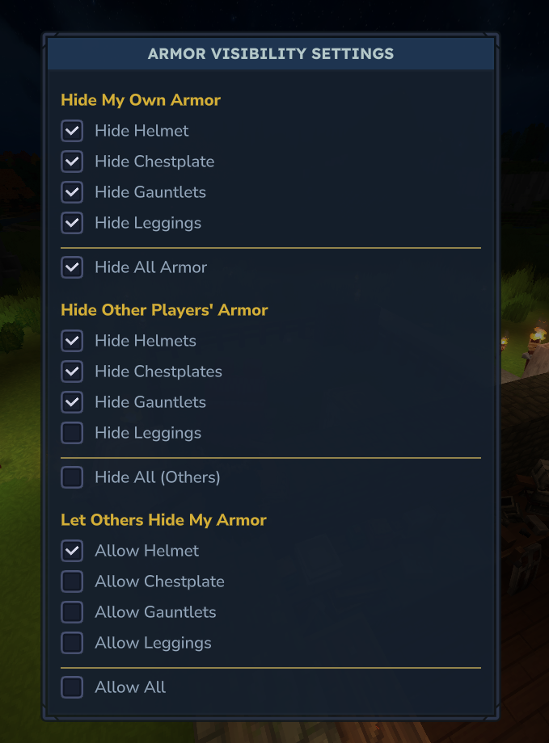

# HideArmor v0.4.0-alpha

Advanced armor visibility control for Hytale servers with mutual opt-in system.



## Overview

HideArmor gives players granular control over armor visibility through three independent systems:

- Hide your own armor from your view
- Hide other players' armor from your view (requires their permission)
- Control which armor pieces others can hide on you

All changes are client-side visual only and do not affect inventory, stats, or actual equipment.

---

## Features

### Self Armor Control

Hide your own armor pieces in your view without affecting gameplay or how others see you.

### Hide Other Players' Armor

Choose which armor pieces to hide on other players. Requires mutual opt-in.

### Privacy-First Permissions

Other players can only hide your armor if you explicitly allow it per armor slot.

### Per-Slot Granularity

Control each armor piece independently:

- Head (helmet)
- Chest (chestplate)
- Hands (gauntlets)
- Legs (leggings)

### Interactive GUI

Modern checkbox-based interface with three clearly labeled sections for easy configuration.

### Persistent Settings

All preferences automatically save to disk and restore on server restart.

---

## How It Works

### Mutual Opt-In System

For other players' armor to be hidden, **both conditions must be met**:

1. **Viewer** has enabled "Hide Others' [piece]"
2. **Target player** has enabled "Allow Others [piece]"

**Example:**

- Player A enables "Hide Others' Helmet"
- Player B has NOT enabled "Allow Helmet"
- Result: Player A still sees Player B's helmet (permission denied)

Once Player B enables "Allow Helmet", Player A will no longer see it.

---

## Commands

Toggle **Head** slot only.

### `/hidehelmet`

Output:

- `HideHelmet: ON`
- `HideHelmet: OFF`

### `/hidearmor`

| Usage | Description |
|-------|-------------|
| `/hidearmor` | Show help + current status |
| `/hidearmor status` | Show hidden slots |
| `/hidearmor <slot>` | Toggle slot (`head`, `chest`, `hands`, `legs`) |
| `/hidearmorui` | Opens Gui menu for toggle |
| `/hidearmor on <slot>` | Force hide slot |
| `/hidearmor off <slot>` | Force show slot |
| `/hidearmor all` | Toggle all slots |
| `/hidearmor on all` | Hide all slots |
| `/hidearmor off all` | Show all slots |

**Examples:**

```
/hidearmor                  Open the interactive GUI
/hidearmorui                Alternative command to open GUI
```

### Self Armor Control

```
/hidearmor <piece>          Toggle specific piece (head|chest|hands|legs)
/hidearmor all              Toggle all armor pieces
/hidearmor on <piece>       Force hide piece
/hidearmor off <piece>      Force show piece
/hidearmor on all           Hide all pieces
/hidearmor off all          Show all pieces
```

### Hide Other Players' Armor

```
/hidearmor hideothers <piece>       Toggle hiding piece on others
/hidearmor hideothers all           Toggle hiding all on others
```

### Permission Control

```
/hidearmor allowothers <piece>      Toggle allowing others to hide piece
/hidearmor allowothers all          Toggle allowing all pieces
```

### Status & Info

```
/hidearmor status           Show all current settings
/hidehelmet                 Quick toggle for helmet only
```

---

## GUI Layout

The interface is organized into three sections:

**Hide My Own Armor**

- Independent checkboxes for each armor slot
- "Hide All Armor" toggle for quick control

**Hide Other Players' Armor**

- Choose which pieces to hide on others
- "Hide All (Others)" toggle

**Let Others Hide My Armor**

- Grant permission for specific pieces
- "Allow All" toggle

Each section has visual separators and labeled headers for clarity.

---

## Installation

1. Download the latest `.jar` from the releases page
2. Place it in your server's `plugins` folder
3. Restart the server
4. Configuration file `players.json` will be created automatically

---

## Persistence

**Storage Location:** `plugins/HideArmor/players.json`

**Format:**

```json
{
  "players": {
    "uuid": mask_value
  }
}
```

**Mask Format:** 12-bit integer

- Bits 0-3: Self armor (head, chest, hands, legs)
- Bits 4-7: Hide others' armor
- Bits 8-11: Allow others permissions

Settings are automatically saved with a 1.5 second debounce to reduce disk I/O.

---

## Technical Details

### Packet Filtering

- Intercepts outgoing `EntityUpdates` packets
- Modifies `Equipment.armorIds` based on visibility rules
- Uses UUID caching for performance optimization
- Thread-safe state management with `ConcurrentHashMap`

### What It Does NOT Do

- Does not modify actual equipped items
- Does not change inventory contents
- Does not affect armor durability or stats
- Does not affect server-side combat calculations
- Does not hide hand-held tools or weapons

### Performance

- Zero server-side gameplay impact
- Minimal packet processing overhead
- Efficient caching system for entity resolution
- Debounced disk writes

---

## Compatibility

**Hytale Version:** Early Access SDK
**Server Type:** Hytale dedicated servers
**Conflicts:** None known

---

## Permissions

By default, all players can use all commands. Server administrators can restrict access through their permission management system if desired.

---

## Troubleshooting

**Armor not hiding:**

- Check that settings are enabled in the GUI
- For other players' armor, verify both conditions are met (hide + allow)
- Try `/hidearmor status` to verify current settings

**Settings not saving:**

- Check file permissions on `plugins/HideArmor/` directory
- Verify `players.json` is not locked by another process
- Check server logs for save errors

**GUI not opening:**

- Ensure you're using `/hidearmor` with no arguments
- Check console for UI loading errors
- Verify the `.ui` file is present in the jar

---

## Version History

**v0.4.0-alpha** - Mutual Opt-In System

- Added "Hide Other Players' Armor" feature
- Added "Allow Others" permission system
- Implemented mutual opt-in logic
- Expanded GUI with three sections
- Extended persistence to 12-bit masks
- Added new command subcommands

**v0.3.0-alpha** - Interactive GUI

- Added native Hytale UI integration
- Checkbox-based controls
- Real-time visual updates

**v0.1.0-alpha** - Initial Release

- Self-armor hiding functionality
- Command-line interface
- Basic persistence

---

## Credits

Inspired by [PabloBora/HideHelmet](https://github.com/PabloBora/HideHelmet)

Built for the Hytale modding community.

---

## License

See LICENSE file for details.
